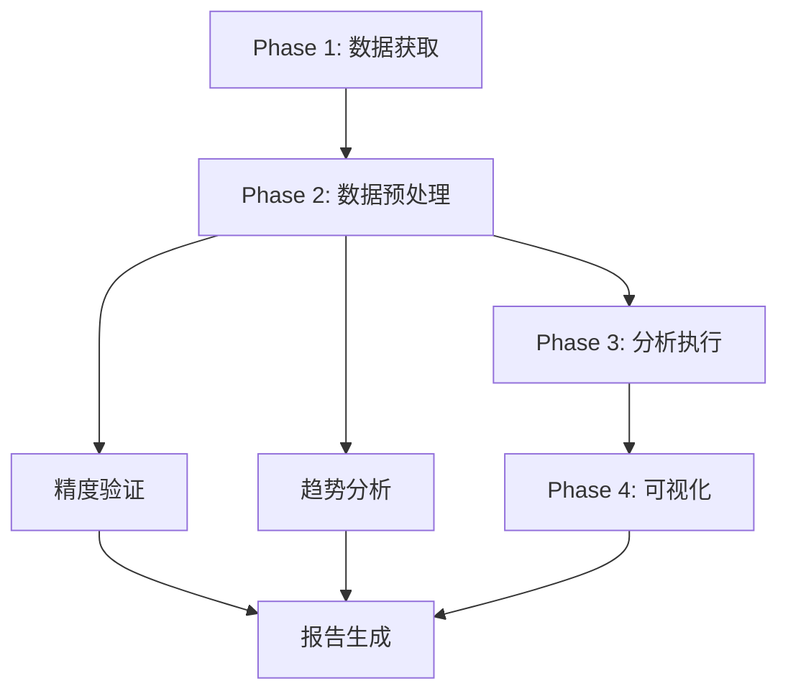

# 湿地数据集分析方案：热带亚热带区域

## 一、数据集概览与对比分析矩阵

### 1.1 可分析数据集清单

**表1.1 可分析数据集清单**

| 数据集 | 时间范围 | 空间分辨率 | 数据类型 | 分类 | 重叠时间段 | 适用分析 |
|--------|----------|------------|----------|------|------------|----------|
| **GIEMS-MC** | 1992-2020 | 0.25° (~27km) | 分数(0-1) | 否 | 2013-2020 | 趋势分析、空间对比 |
| **WAD2M** | 2000-2018 | 0.25° (~27km) | 分数 | 否 | 2000-2018 | 趋势分析、空间对比 |
| **SWAMPS** | 1992-2018 | 0.25° (~27km) | 分数 | 否 | 1992-2018 | 趋势分析、空间对比 |
| **LSTM Wetland** | 1992-2024 | 0.25° | 分数(0-1) | 否 | 2013-2020 | 趋势分析、空间对比 |
| **GWD30** | 2013-2022 | 30m | 15类分类 | 是 | 2013-2020 | 空间精度验证、分类评估 |
| **GLWD v2** | 1990-2020 | ~500m | 33类分类 | 是 | (静态基准) | 空间基准参考 |
| **G2017** | Static | ~232m | 多类分类 | 是 | (静态基准) | 热带亚热带基准 |
| **TOPMODEL** | 1980-2020 | 0.25° | 分数 | 否 | 2000-2018 | 趋势分析、模型对比 |
| **Berkeley-RWAWC** | 2018-现在 | 0.01° (~1km) | 二值(0/1) | 否 | 2018-现在 | 高分辨率验证 |

### 1.2 重叠分析时段

```
时间轴: 1992 ----2000----2013----2018----2020----2024
        |-----------|-------|-------|-------|-------|
        GIEMS-MC:  ════════════════════════════════
        WAD2M:           ════════════════════════
        SWAMPS:    ═════════════════════════════
        LSTM:      ════════════════════════════════════
        GWD30:           ═══════════════════
        G2017:       [======静态基准======]
        TOPMODEL:  ═══════════════════════════════
        Berkeley:                      ═══════
```

**推荐分析时段:**
- **短期高分辨率验证 (2018-2020)**: GWD30 (30m) vs Berkeley-RWAWC (1km) vs LSTM
- **中期趋势分析 (2000-2018)**: GIEMS-MC vs WAD2M vs SWAMPS vs TOPMODEL
- **长期历史重建 (1992-2020)**: GIEMS-MC vs SWAMPS

---

## 二、热带亚热带区域 (Tropical & Subtropical) 边界定义

### 2.1 地理范围

根据G2017和Berkeley-RWAWC的定义:

| 区域 | 纬度范围 | 经度范围 |
|------|----------|----------|
| 热带 (Tropical) | 23.5°N - 23.5°S | 全经度 |
| 亚热带 (Subtropical) | 23.5°S - 40°S / 23.5°N - 40°N | 全经度 |
| **合计分析范围** | **40°S - 40°N** | **全经度** |

### 2.2 重点研究区域

| 区域名称 | 纬度范围 | 经度范围 | 湿地类型 | 代表数据集 |
|----------|----------|----------|----------|------------|
| 亚马逊流域 | 10°N - 20°S | 80°W - 50°W | 热带雨林湿地 | GWD30, GIEMS-MC |
| 刚果盆地 | 10°N - 10°S | 12°E - 30°E | 热带沼泽 | GWD30, GLWD v2 |
| 东南亚 | 10°S - 25°N | 90°E - 150°E | 红树林、泥炭地 | GWD30, G2017 |
| 澳大利亚北部 | 10°S - 20°S | 115°E - 150°E | 热带稀树草原湿地 | GWD30, SWAMPS |
| 南亚 | 5°N - 30°N | 60°E - 100°E | 洪泛区、稻田 | GWD30, GIEMS-MC |
| 西非 | 15°N - 10°N | 20°W - 30°E | 季节性洪泛 | SWAMPS, TOPMODEL |
| 潘塔纳尔湿地 | 15°S - 22°S | 50°W - 60°W | 季节性湿地 | GWD30, G2017 |

---

## 三、具体分析任务分解

### 3.1 任务A: 高分辨率空间精度验证 (2018-2020)

**目标**: 使用30m GWD30作为主验证基准，评估粗分辨率产品的空间准确性

**数据配对**:

| 验证目标 | 参考数据 | 时间范围 | 分辨率对比 |
|----------|----------|----------|------------|
| GWD30 (30m) | Sentinel-2/Landsat目视解译 | 2018-2020 | 1:1 |
| GIEMS-MC (27km) | GWD30聚合 | 2018-2020 | 27km:30m |
| LSTM Wetland (27km) | GWD30聚合 | 2018-2020 | 27km:30m |
| Berkeley-RWAWC (1km) | GWD30聚合 | 2018-2020 | 1km:30m |
| WAD2M (27km) | GWD30聚合 | 2018 | 27km:30m |

**分析指标**:
- Overall Accuracy (OA)
- Kappa系数
- Producer's Accuracy (湿地检测率)
- User's Accuracy (误检率)
- IoU (Intersection over Union)

**空间聚合方法**:
- 27km: 30m GWD30 → 900×900像素聚合 (众数法)
- 1km: 30m GWD30 → 33×33像素聚合 (均值法，转二值)

### 3.2 任务B: 跨数据集趋势一致性分析 (2000-2018)

**目标**: 评估不同数据集在热带亚热带地区的趋势一致性

**参与数据集**:
1. GIEMS-MC (1992-2020, 0.25°)
2. WAD2M (2000-2018, 0.25°)
3. SWAMPS (1992-2018, 25km)
4. TOPMODEL (1980-2020, 0.25°)

**分析时段**: 2000-2018 (共同重叠期)

**空间范围**: 40°S - 40°N, 全经度

**分析网格**: 0.25° × 0.25° (约27km)

**趋势检验方法**:
- Mann-Kendall趋势检验 (α=0.05)
- Sen's Slope趋势斜率
- Pearson相关系数 (两两对比)

**输出矩阵**:
```
        | GIEMS-MC | WAD2M | SWAMPS | TOPMODEL
--------|----------|-------|--------|----------
GIEMS-MC|    -     |  r    |  r     |   r
WAD2M   |    r    |   -   |  r     |   r
SWAMPS  |    r    |  r    |   -    |   r
TOPMODEL|    r    |  r    |  r     |   -
```

### 3.3 任务C: 热带亚热带静态基准对比

**目标**: 使用G2017和GLWD v2作为静态基准验证动态数据集的空间格局

**静态基准数据**:
- G2017: 热带亚热带湿地 (~232m, 静态)
- GLWD v2: 全球湿地 (~500m, 静态)

**动态验证数据**:
- GWD30 (2013-2020年均)
- GIEMS-MC (2015年平均)
- LSTM Wetland (2015年平均)

**分析内容**:
1. 空间格局对比 (kappa, 空间相关性)
2. 类别一致性 (针对GWD30的15类 vs G2017分类)
3. 面积估算差异

---

## 四、制图方案

### 4.1 地图产品清单

| 地图编号 | 地图名称 | 类型 | 配色方案 |
|----------|----------|------|----------|
| **Map-1** | 热带亚热带湿地分布总览 | 多数据集叠加 | 分类配色 |
| **Map-2** | 数据集空间一致性差异图 | 热力图 | 红-黄-绿 |
| **Map-3** | 趋势方向空间分布 | 符号地图 | 蓝(增)/红(减) |
| **Map-4** | 趋势幅度空间分布 | 分级填色 | 渐变色阶 |
| **Map-5** | 重点区域详图 (6个) | 多尺度 | 因区域而异 |
| **Map-6** | 时间序列变化动图 | 动画 | 季节性色阶 |

### 4.2 地图详细规格

#### Map-1: 热带亚热带湿地分布总览

**内容**: 展示6个主要数据集在热带亚热带的年均湿地覆盖

**布局**:
```
┌─────────────────────────────────────────────────┐
│         热带亚热带湿地分布对比 (2015年)           │
├─────────────────────────────────────────────────┤
│                                                 │
│   [GWD30]    [GIEMS-MC]    [LSTM Wetland]    │
│    30m        27km           27km             │
│                                                 │
├─────────────────────────────────────────────────┤
│   [GLWD v2]   [G2017]     [Berkeley-RWAWC]   │
│    500m        232m          1km               │
│                                                 │
└─────────────────────────────────────────────────┘
```

**投影**: 等面积投影 (Equal-Area Cylindrical, EPSG:3410)

**分辨率**: 72 DPI, 宽2000px

**配色**:
- 湿地: #2E7D32 (绿色系)
- 非湿地: #F5F5F5 (浅灰)
- 水体: #1976D2 (蓝色)
- 无数据: #E0E0E0

#### Map-2: 数据集空间一致性差异图

**内容**: 显示GIEMS-MC vs WAD2M vs SWAMPS之间的空间差异

**方法**:
- 三个数据集两两比较
- 差异 = |Dataset A - Dataset B|
- 取三个比较的平均差异

**配色方案**:
- 高度一致 (差异<0.1): #1B5E20 (深绿)
- 轻度差异 (0.1-0.3): #8BC34A (浅绿)
- 中度差异 (0.3-0.5): #FFEB3B (黄)
- 高度差异 (>0.5): #D32F2F (红)

#### Map-3: 趋势方向空间分布

**内容**: 各网格趋势方向 (增加/减少/无显著趋势)

**符号**:
- ↑ 显著增加 (p<0.05, Sen's slope > 0): 蓝色
- ↓ 显著减少 (p<0.05, Sen's slope < 0): 红色
- ○ 无显著趋势: 灰色

**底图**: 黑色世界底图

#### Map-4: 趋势幅度空间分布

**内容**: Sen's Slope值的空间分布

**分级**:
- 强增加 (slope > 0.05): 深蓝
- 轻度增加 (0.01-0.05): 浅蓝
- 稳定 (-0.01 - 0.01): 白色
- 轻度减少 (-0.05 - -0.01): 浅红
- 强减少 (slope < -0.05): 深红

#### Map-5: 重点区域详图

**6个重点区域**:

| 区域 | 中心坐标 | 范围 | 底图zoom |
|------|----------|------|----------|
| 亚马逊 | -3°S, 60°W | 10°×10° | 4 |
| 刚果 | 0°, 20°E | 10°×10° | 4 |
| 东南亚 | 0°, 110°E | 15°×15° | 3 |
| 澳大利亚北部 | -15°S, 135°E | 10°×10° | 4 |
| 南亚 | 25°N, 80°E | 15°×15° | 3 |
| 潘塔纳尔 | -18°S, 55°W | 8°×8° | 5 |

**多尺度**: 每区域提供3个zoom级别

#### Map-6: 时间序列动画

**内容**: 1992-2020年湿地动态变化

**帧率**: 1年/帧 (共29帧)

**格式**: GIF + MP4

**辅助图层**:
- 年际变化趋势线
- 季节性波动范围 (阴影区域)

---

## 五、分析时间线

### Phase 1: 数据准备 (第1-3周)

> **注意**: 预留1周缓冲时间应对数据获取延迟

| 任务 | 数据源 | 输出 |
|------|--------|------|
| 1.1 下载GWD30 2013-2020 MGRS瓦片 | GWD30 CDN | GeoTIFF (~2TB) |
| 1.2 下载GIEMS-MC NetCDF | ESA Earth Online | NetCDF (~50GB) |
| 1.3 下载WAD2M月度数据 | Zenodo | NetCDF (~30GB) |
| 1.4 下载SWAMPS | NASA Earth Data | NetCDF (~30GB) |
| 1.5 下载LSTM Wetland | 待确认 | NetCDF (~30GB) |
| 1.6 下载G2017/GLWD v2静态 | 各自CDN | GeoTIFF (~10GB) |
| 1.7 下载Berkeley-RWAWC | Zenodo | NetCDF (~5GB) |

### Phase 2: 预处理 (第4周)

| 任务 | 内容 |
|------|------|
| 2.1 空间裁剪 | 40°S-40°N, 全经度 |
| 2.2 分辨率统一 | 统一到0.25° (WAD2M原始分辨率) |
| 2.3 时间对齐 | 统一到年度/月度 |
| 2.4 分类转换 | 类别→二值 (湿地/非湿地) |
| 2.5 质量控制 | 标记无效值 |

### Phase 3: 分析执行 (第5-7周)

> **注意**: 根据数据质量可能需要额外1-2周

| 任务 | 内容 |
|------|------|
| 3.1 精度验证 | GWD30 vs Sentinel-2参考 |
| 3.2 跨数据集比较 | OA, Kappa, IoU计算 |
| 3.3 趋势分析 | Mann-Kendall, Sen's Slope |
| 3.4 一致性矩阵 | 两两相关计算 |

### Phase 4: 可视化与报告 (第8-10周)

> **注意**: 总工期预留2周缓冲用于问题修复和迭代

| 任务 | 内容 |
|------|------|
| 4.1 静态地图 | Map-1 到 Map-5 |
| 4.2 动画制作 | Map-6 |
| 4.3 统计图表 | 精度对比条形图, 相关矩阵热力图 |
| 4.4 报告撰写 | Markdown报告 |

---

### 风险评估

**表5.2 项目风险评估表**

| 风险类型 | 可能性 | 影响 | 缓解措施 |
|----------|--------|------|----------|
| 数据下载失败 | 中 | 高 | 多源备份、增量下载、断点续传 |
| 计算资源不足 | 中 | 中 | 云资源备用、算法优化、分块处理 |
| 时间延误 | 高 | 中 | 增加缓冲时间、优先级调整、并行执行 |
| 数据质量不达预期 | 低 | 高 | 多源交叉验证、质量控制流程 |
| 存储空间不足 | 中 | 中 | 分级存储、及时清理中间文件 |

### 任务依赖关系



## 六、数据质量标注

### 6.1 已知数据问题

| 数据集 | 问题 | 影响范围 | 规避方法 |
|--------|------|----------|----------|
| SWAMPS | 干旱区高估 | 撒哈拉、澳大利亚 | 排除干旱区分析 |
| GWD30 | 云污染 | 热带雨林 | 使用多时相合成 |
| GIEMS-MC | 空间平滑 | 边界过渡带 | 阈值敏感性分析 |
| TOPMODEL | 高纬度不准确 | >50° | 仅分析40°S-40°N |

### 6.2 验证声明

- GWD30 (30m) 作为"高分辨率参考"，但其自身也存在约85%精度
- Sentinel-2/Landsat 目视解译作为"真值"，但受限于解译者经验
- 趋势分析基于统计显著性，不等同于实际生态变化

---

## 七、输出清单

### 7.1 数据文件

**表7.1 输出数据文件清单**

| 文件名 | 格式 | 描述 |
|--------|------|------|
| tropical_wetland_comparison_2015.tif | GeoTIFF | 6数据集叠加图 |
| trend_direction_2000_2018.tif | GeoTIFF | 趋势方向空间分布 |
| trend_magnitude_2000_2018.tif | GeoTIFF | 趋势幅度空间分布 |
| accuracy_matrix.csv | CSV | 精度指标矩阵 |
| trend_correlation_matrix.csv | CSV | 趋势相关矩阵 |

### 7.2 可视化文件

| 文件名 | 格式 | 描述 |
|--------|------|------|
| map1_distribution_overview.png | PNG | 湿地分布总览 |
| map2_spatial_consistency.png | PNG | 空间一致性差异 |
| map3_trend_direction.png | PNG | 趋势方向分布 |
| map4_trend_magnitude.png | PNG | 趋势幅度分布 |
| charts_accuracy_comparison.png | PNG | 精度对比图 |
| charts_correlation_heatmap.png | PNG | 相关矩阵热力图 |
| animation_wetland_dynamics.gif | GIF | 1992-2020动态 |

### 7.3 报告文件

| 文件名 | 格式 | 描述 |
|--------|------|------|
| evaluation_report.md | Markdown | 主报告 |
| methodology.md | Markdown | 方法论 |
| data_quality_notes.md | Markdown | 数据质量说明 |

---

## 七、附录: 技术参数速查

### 坐标参考系
- 分析投影: EPSG:4326 (WGS84)
- 等面积制图: EPSG:3410 (World Cylindrical Equal Area)

### 空间分辨率
| 数据集 | 原始分辨率 | 分析分辨率 |
|--------|------------|------------|
| GWD30 | 30m | 27km (聚合) |
| GLWD v2 | ~500m | 27km (聚合) |
| G2017 | ~232m | 27km (聚合) |
| GIEMS-MC | 27km | 27km (原始) |
| WAD2M | 27km | 27km (原始) |
| SWAMPS | 27km | 27km (原始) |
| Berkeley-RWAWC | 1km | 27km (聚合) |

### 分类阈值
- GIEMS-MC: 0.1 (湿地存在阈值)
- WAD2M: 0.1
- SWAMPS: 0.1
- Berkeley-RWAWC: 0.5 (二值化)
- GWD30: 类别1-14为湿地

### 趋势检验参数
- Mann-Kendall: α = 0.05
- 最小时间点: 10年
- 预白化: 当自相关 r1 > 0.1时应用
